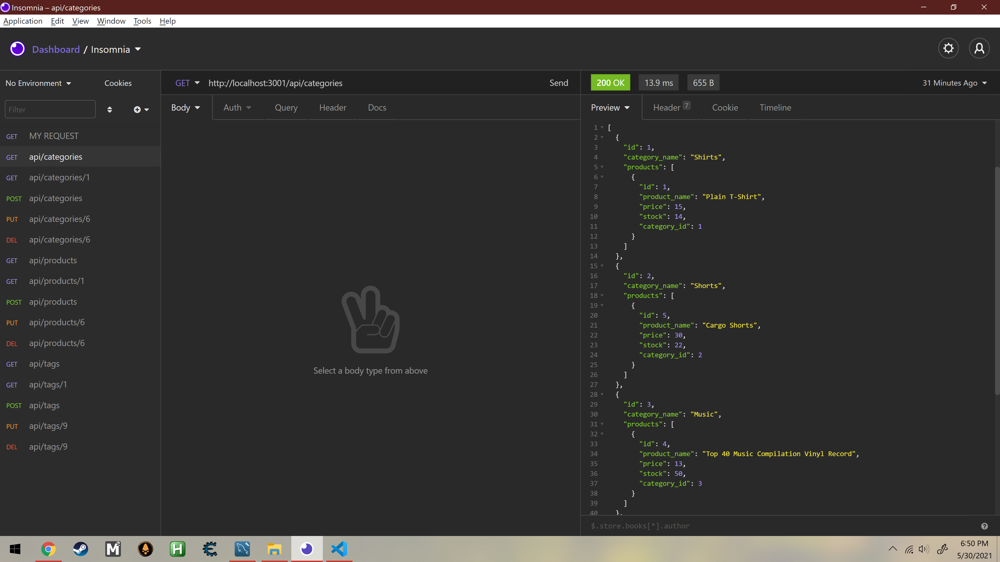

# 13-Object-Relational-Mapping-ORM
# E-Commerce Back End

This application is the back end of a hypothetical e-commerce website. It contains models and routes for a variety of products, product categories, and product tags, and connects to a MySQL database. Using Insomnia, various routes (GET, GET by id, POST, PUT, and DELETE) for these three items can be visualized, as the application currently has no front end.

The E-Commerce Back End application's GitHub repository can be found [here](https://github.com/elisesamanthadaly/13-Object-Relational-Mapping-ORM).

## Installation
Clone the repository to your local machine. You should also have Git Bash, Node.js, and MySQL/MySQL Workbench installed. You'll need to run npm install from the terminal at the root directory of the local repository to install the application's dependencies (express, sequelize, mysql, and dotenv). You will also need to create a .env file (containing DB_USER=root, DB_PW=YourPassword, DB_NAME='ecommerce_db') at this location. Before running the application, create its database in MySQL Workbench. You can copy/paste the contents of db/schema.sql into a MySQL query to do so.

## Usage

This [video](https://drive.google.com/file/d/1JxEPnB8SXjvzFUsH2WfBxt8vNjX_ihE0/view) details how to use the E-Commerce Back End application.

## Credits

This application relies on [express](https://www.npmjs.com/package/express), [sequelize](https://www.npmjs.com/package/sequelize), and [mysql](https://www.npmjs.com/package/mysql). It also uses [dotenv](https://www.npmjs.com/package/dotenv).

## License

MIT License

Copyright (c) 2021 Elise Daly

Permission is hereby granted, free of charge, to any person obtaining a copy
of this software and associated documentation files (the "Software"), to deal
in the Software without restriction, including without limitation the rights
to use, copy, modify, merge, publish, distribute, sublicense, and/or sell
copies of the Software, and to permit persons to whom the Software is
furnished to do so, subject to the following conditions:

The above copyright notice and this permission notice shall be included in all
copies or substantial portions of the Software.

THE SOFTWARE IS PROVIDED "AS IS", WITHOUT WARRANTY OF ANY KIND, EXPRESS OR
IMPLIED, INCLUDING BUT NOT LIMITED TO THE WARRANTIES OF MERCHANTABILITY,
FITNESS FOR A PARTICULAR PURPOSE AND NONINFRINGEMENT. IN NO EVENT SHALL THE
AUTHORS OR COPYRIGHT HOLDERS BE LIABLE FOR ANY CLAIM, DAMAGES OR OTHER
LIABILITY, WHETHER IN AN ACTION OF CONTRACT, TORT OR OTHERWISE, ARISING FROM,
OUT OF OR IN CONNECTION WITH THE SOFTWARE OR THE USE OR OTHER DEALINGS IN THE
SOFTWARE.